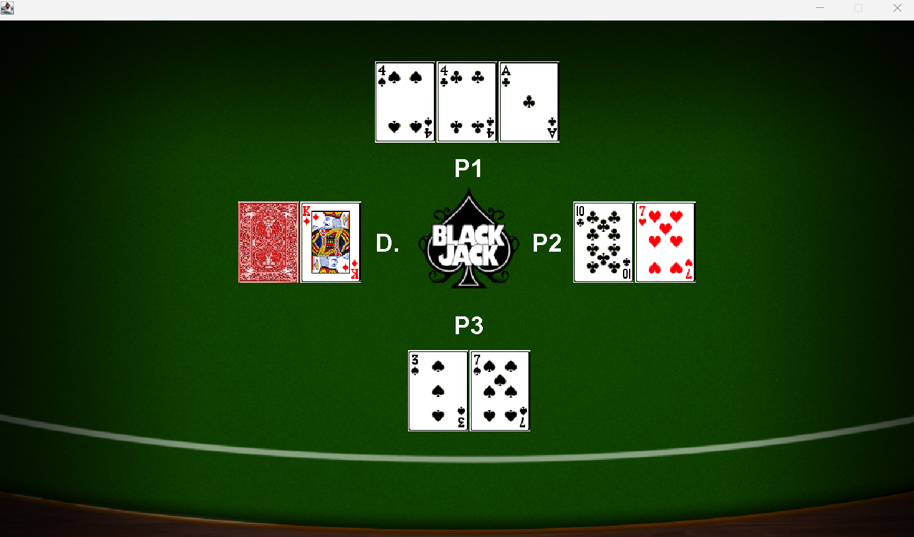

# Blackjack Game

## Overview

Welcome to the Blackjack Game, a console-based implementation of the classic card game built using Java. This project provides a captivating and interactive experience where players can test their luck against an AI dealer.

## Features

- **Player vs Dealer:** Engage in thrilling Blackjack matches against a strategic AI dealer.
- **User-Friendly Interface:** Enjoy a console-based UI designed for simplicity and ease of use.
- **Card Deck Management:** Experience efficient card deck management to ensure a fair and dynamic game.
- **Game Logic:** Immerse yourself in the world of Blackjack with the implementation of standard rules for hitting, standing, and scoring.

## How to Play

1. **Clone the Repository:**
    ```bash
    git clone https://github.com/SeifHesham2/BlackJack.git
    ```

2. **Navigate to the Project Directory:**
    ```bash
    cd BlackJack
    ```

3. **Compile and Run the Game:**
    ```bash
    javac Blackjack.java
    java Blackjack
    ```

## Screenshots



## Getting Started

Ensure you have Java installed on your system. If not, download and install it from [Java's official website](https://www.oracle.com/java/).

## Contribution

Feel free to contribute to the project by opening issues or submitting pull requests. Your feedback and enhancements are highly valued!

Enjoy your Blackjack experience!
